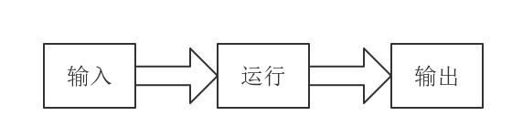

<notice>教程读者请不要直接阅读本文件，因为诸多功能在此无法正常使用，请移步至[程谱 coderecipe.cn](https://coderecipe.cn/learn/7)学习完整教程。如果您喜欢我们的教程，请在右上角给我们一个“Star”，谢谢您的支持！</notice>
初入Python编程
======

欢迎来到程谱社区！😁 我们是一群留学生，致力于搭建一个系统而又不枯燥的零基础入门编程学习平台。希望大家能多多支持我们，如果发现我们的不足之处也欢迎联系我们~

从这里开始学习吧！💖

输入输出
------
对于计算机程序的运行来说，我们先给程序提供必要的数据信息（输入），然后程序进行一系列的运算，再把结果告诉我们（输出），就像下面这张图画的这样：


在Python里，输入用的是`input()`函数，如果我们想得到用户在程序里的输入，我们可以使用如下的语句：
```python
input()#输入
```

输出用的则是`print()`函数，如果我们想输出`Hello Python!`，则可以使用如下的语句：

```python
print("Hello Python!")#打印Hello Python!
```

上面的语句中的一对双引号意味着我们要原样输出引号之间的内容，整个语句的意思是要输出`Hello Python!`**并且** 换行，这里的`"Hello Python!"`有一个名字，叫字符串(String)。当然我们也可以使用不换行的版本：
```python
print("Hello Python", end='')#end参数表示这句话以''空符结尾
```

下面是练习框，让我们跟着练习框的下方的指示一起来熟悉一下练习环境吧。

<lab lang="python" parameters="filename=Hello.py">
<notice>练习环境在此无法显示，请移步至[程谱 coderecipe.cn](https://coderecipe.cn/learn/7)查看。</notice>
#python3
#在这里输入代码
</lab>

让我们在`#在这里输入代码`后面另起一行，输入：
```python
print("Hello Python!")
```
之后点击“运行”按钮。

这样，我们就做出了一个小程序，它能做出最基本的输出功能，是不是很有意思呀~

掌握了吗？如果掌握了，就按一下右下方这个按钮吧~

转义
------
如果是输出简单的文字，那上面的知识已经足够了，但如果是要输出一些特殊的文字，比如`"`，直接放入引号内可就不行了，我们可以试一试：

<lab lang="python" parameters="filename=Hello.py">
<notice>练习环境在此无法显示，请移步至[程谱 coderecipe.cn](https://coderecipe.cn/learn/7)查看。</notice>
#python3
#在这里输入代码
print(""")
</lab>

运行之后我们会发现错误是`SyntaxError: EOF while scanning triple-quoted string literal`,这其实想告诉我们的是，Python会发现我们有三个引号，他不能分辨这三个引号哪两个是一对。在Python里面，我们可以在"前面加一个`\`来告诉Python，方式如下：

<lab lang="python" parameters="filename=Hello.py">
<notice>练习环境在此无法显示，请移步至[程谱 coderecipe.cn](https://coderecipe.cn/learn/7)查看。</notice>
#python3
#在这里输入代码
print("\"")
</lab>

这样就可以成功输入一个双引号了。在这里，我们涉及了一个概念，叫做**转义**(escape)，之前用的一个`\"`则称为**转义序列**(escape sequence)。常见的转义序列有：

| 序列 | 含义 |
| - | - |
| `\"` | 双引号 |
| `\n` | 换行 |
| `\\` | `\`本身 |
|`\'`| 单引号|

需要注意的是，单引号和双引号的功能在python里的功能一样。所以当你需要输出的时候用单引号代替双引号是完全没有问题的。如下面所示。
 `print('Hello Python!')`
所以除了运用**转义**来输出单引号或双引号，你还可以
```print("'") #输出一个单引号
print('"') #输出一个双引号
```

注释
------
你可能已经在上面的代码里发现了`# 在这里输入代码`这一行，这一行就是我们所称的注释（comment），这行对于Python来说并没有什么含义，然而对阅读代码的人来说却至关重要。注释描述了代码的内容和要注意的点。注释有两种，一种是行注释，就像上面的这个例子，只对一行`#`后面的内容有效，另一种是块注释，写法是`"""注释内容"""`对两个`"""`之间的内容都有效，可以好几行。

小练习
------
让我们来练习一下我们刚学习的知识吧。
<lab lang="python" parameters="filename=Hello.py">
<notice>练习环境在此无法显示，请移步至[程谱 coderecipe.cn](https://coderecipe.cn/learn/7)查看。</notice>
#python3  
#在这里输入代码
</lab>

试试做出如下的效果：

1. 输出“我要认真学习编程” （不带引号）
2. 用不同的方式输出“""”（两个英文双引号）
3. 输出ABC，然后换行输出DEF

学到这里，你就已经入门Python编程啦👏，加油加油继续学习吧~
