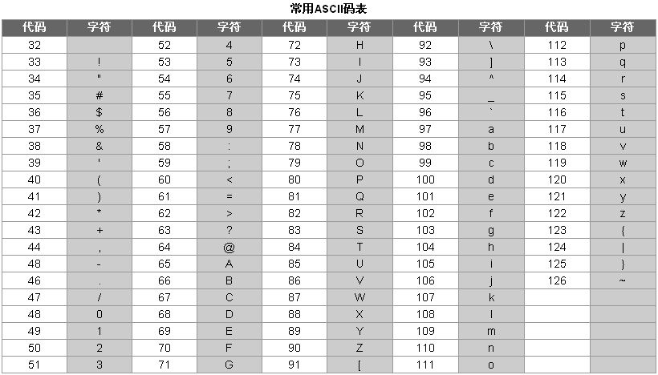

<notice>教程读者请不要直接阅读本文件，因为诸多功能在此无法正常使用，请移步至[程谱 coderecipe.cn](https://coderecipe.cn/learn/2)学习完整教程。如果您喜欢我们的教程，请在右上角给我们一个“Star”，谢谢您的支持！</notice>
变量和类型
======

🌟你已经到到第二章啦，继续加油吧~

变量的定义、赋值和读取
------
变量(variable)，就是可以改变的量，例如在程序运行的一开始这个量是1，后面可以变为2，到程序运行结束的时候可以变为100。在计算机中，我们可以把各种类型的数据（如一个数字、一个字符串）存储在变量中。我们就需要知道变量的几个最基本的用法——定义、赋值、读取和操作。

定义主要是为了明确这个变量在哪里可以被访问到（作用域）和变量的类型。而赋值就是给变量存一个值，比如我们把100存入一个变量（称为`a`），那么`a`里面就存着100这个数字。读取（或说取值）相当于把这个值从变量里面取出来，如果我们取刚才所存的`a`变量，会得到一个100。

在Python中，变量的类型是可以随意变化的。比如，一个变量名为`variable`的变量可以一开始初始化为整数型

```python
variable=666
```
如果想要把这个`variable`变为字符串：
```python
variable='Hello!'# 字符串需要用两个双引号或两个单引号括起来
```
创建一个任意类型的变量：
```python
变量名 = 值
```
变量的类型在本章中稍后会具体介绍。

在python中，你无须提前声明变量，更不需要声明变量的类型，python会根据你每次给的值来判断这个变量的类型。

两个变量可以用`=`赋值，`=`右边的值会覆盖`=`左边变量的值：
```python
text = variable;#创建一个变量叫text，并将variable的值赋给text
```
同时，在Python中，你可以用`+`号把**同一类型**的变量连起来
<lab lang="python" parameters="filename=Hello.py">
<notice>练习环境在此无法显示，请移步至[程谱 coderecipe.cn](https://coderecipe.cn/learn/2)查看。</notice>
str1 = "Hello "
str2 = "Java!"
print(str1+str2) # 连接str1和str2并输出
</lab>

输出变量
------
在python中输出变量非常简单，如下列代码所示。
```
a=10
print(a)
```
如果你想要在一个字符串后面输入数字的话，你可以加个英文逗号，再加上变量名。
```
a=10
print("The number is ",a)
```
但是当我们需要在字符串中间输入数字该怎么办呢？ 我们可以用`%d`来代替这个整数变量需要出现的位置，对于浮点类型，我们可以用`%f`来代替。然后在引号外面，括号里面将`%`加在变量前，变量按出现顺序排列，否则会报错。
```
age=16
score=99.9
print("I am %d years old, my score is %f." %(age,score))
```
来试着输出变量吧！

<lab lang="python" parameters="filename=Hello.py">
<notice>练习环境在此无法显示，请移步至[程谱 coderecipe.cn](https://coderecipe.cn/learn/2)查看。</notice>
#python3
name='John'
#输出你的名字
</lab>

给变量起名字
------
在实际编程中，变量的命名都是很重要的。一般我们用这4条规则来给变量起名：
1. 变量名称需要有描述性，比如（`string`这种变量名就没有准确描述存储的内容）
2. 如果要描述内容的名称只有一个单词，那么这个变量名可以用这个单词的全小写形式（如`number`），如果名称由两个或两个以上个单词组成，那么变量名为第一个单词首字母小写，剩下的单词紧跟着第一个单词，但第一个字母大写（如学生数量为`studentNumber`）
3. 在变量名中，第一个位置不能是数字（如不能以`1Hello`作为变量名），同时变量名不能有空格，不能有“-”、“/”等对计算机来说有歧义的符号（如`abc*def`会被计算机理解成abc乘以def）
4. 在Python中，变量不能是系统保留用的关键字（比如`str`、`int`、`break`）

类型及储存方式
------
### 整数类型（简称整型, int）
在计算机中，整数是以二进制形式储存的，也就是说当我们往Python里储存十进制的`2`时，Python实际上存储的是二进制的`10`。一个二进制的`0`或`1`称为一个比特（bit），8个比特为一个字节（byte）。而Python的`int`由32个bit组成，所以可以有`2^32`（2的32次方）种状态，因为还需要存储负数，因此可以存储`-2^31`到`2^31-1`之间的数。

<!-- TODO: 补充进制转换 -->

### 浮点类型 （float）
浮点类型可以对应我们一般称的“小数”，同样也是通过二进制储存的，只不过并不是像整数那样直接储存，而是使用了科学计数法。

`符号 * 有效位数 * 2 ^ 指数`

比如如果储存的是正号、有效位数转换为十进制是11，指数是-1，那么经过计算我们可以发现这样表现的数字是5.5。

<lab lang="python" parameters="filename=Hello.py">
<notice>练习环境在此无法显示，请移步至[程谱 coderecipe.cn](https://coderecipe.cn/learn/2)查看。</notice>
#python3
double=1.00
print(double);

</lab>

使用浮点类型要注意的一点是要小心精度错误，因为不是所有数字都可以用浮点类型精确表示的，比如如下操作：
<lab lang="python" parameters="filename=Hello.py">
<notice>练习环境在此无法显示，请移步至[程谱 coderecipe.cn](https://coderecipe.cn/learn/2)查看。</notice>
print(0.1+0.1+0.1+0.1+0.1+0.1+0.1+0.1+0.1+0.1)# 10个0.1相加
print(0.1*10);# 10乘以0.1
</lab>

我们会发现第一个结果不是`1.0`，而是`0.9999999999999999`，这是因为在运算中出现了精度取舍错误（round-off error），如果我们把这个运算和`1.0`比较的话，计算机会告诉我们这两个数字不相等，这在一些操作中是会出现错误的，因此如果我们需要比较两个浮点数是否相等，可以比较两个数的差的绝对值，如果这个绝对值很小（如小于`0.000000001`），就认为这两个数是相等的。

### 字符串类型 （String）
字符串类型储存的是一串文字，之前提到的`"Hello Python!"`本质上就属于字符串类型。字符串的储存方式是把每个字符通过一张叫ASCII码表的转换表对应成数字，再把数字一个一个地按顺序储存起来。

ASCII码表长这样：


### 布尔类型 （boolean）
布尔类型(在Python中简称bool)是一种特殊的类型，只有两种取值，一种是真（`True`），一种是假（`False`）。它主要有两种用途：
1. 用来记录一个属性的是或者不是，例如记录一个人是不是会员，就可以用布尔型变量`isVIP`来记录
2. 布尔是几个操作符的结果类型，比如比较变量`a`是不是等于变量`b`，结果就是一个布尔类型的值，它有可能为真（相等），也有可能为假（不相等）

**注意**布尔类型的`True`和`False`首字母必须大写，否则程序会报错

运算和操作符
------
说了这么多种类型，那么现在我们来看一下怎么用它们来运算。

### 整数运算
整数运算比较容易理解，像加减乘除都属于整数运算。

<lab lang="python" parameters="filename=Hello.py">
<notice>练习环境在此无法显示，请移步至[程谱 coderecipe.cn](https://coderecipe.cn/learn/2)查看。</notice>
# 在这里输入代码
print(888+999)
print(888*999)
print(888-999)
print(10/2)
print(888/999)
print(10%3)# 取余
print(10//3) # 求商数
print(0/0) # 程序报错
</lab>

**注意**：在Python里乘方不是`^`符号，而是需要用`**`，`^`是位运算的异或，比较少用到

最后的`10%3`进行的是除余运算，10除以3等于3余1，因此这个运算的结果为1。

最后的`10//3`进行的是商数运算，10除以3等于3余1，因此这个运算的结果为3.

最后的`0/0`运算会报一个`ZeroDivisionError`的错误，**因为一个数除以`0`没有定义**，这种运行时报错叫做“异常（exception）”，在[“异常”](https://coderecipe.cn/learn/2?chapter=5)一章中我们会讲到。

### 浮点运算
浮点运算同样也是用类似的方法调用：
<lab lang="java" parameters="filename=Hello.java">
<notice>练习环境在此无法显示，请移步至[程谱 coderecipe.cn](https://coderecipe.cn/learn/2)查看。</notice>
// 在这里输入代码
print(99.1+0.9)
print(99.1*99.9)
print(100-0.9)
print(888.0/999)
print(10.2%5)

</lab>

浮点的除余运算，除了用`10.2-2*5`理解方式（其中的2是`10.2/5`的整数部分），还可以理解为用`10.2`去反复减去`5`，直到得到一个小于5的数为止（`10.2-5=5.2 5.2-5=0.2`），因此结果为0.2。

整数运算和浮点运算统称算术运算。

**注意**：别忘了浮点运算可能有精度取舍错误。

### 类型转换
如果我们有两个`float`类型的变量，想要让他们的结果变为成熟，要怎么做呢？这时候就需要用到类型转换了。就像下面这样：
<lab lang="python" parameters="filename=Hello.py">
<notice>练习环境在此无法显示，请移步至[程谱 coderecipe.cn](https://coderecipe.cn/learn/2)查看。</notice>
# 在这里输入代码
print(3.5+4.5) #输出8.0
print(int(3.5+4.5)); #输出8
</lab>

如果我们想把整数类型的变量，字符串和布尔类型的变量一起输出，就需要用到字符串转型了：
<lab lang="python" parameters="filename=Hello.py">
<notice>练习环境在此无法显示，请移步至[程谱 coderecipe.cn](https://coderecipe.cn/learn/2)查看。</notice>
// 在这里输入代码
legs=2
sentence='I have '
isTrue=True
#print(sentence+legs+' legs. This is '+isTrue) 这句话是错的，因为不同类型的变量不可以直接加在一起
print(sentence+str(legs)+' legs. This is '+str(isTrue))
</lab>

**注意**：如果用`int()`将小数转化为整数不是四舍五入，而是舍弃小数部分的整数

类型转换本质上也是一种运算，只不过运算的结果和输入给运算的值类型不同而已。

### 关系运算

关系运算判断的是两个操作数的关系，主要有：

| 运算符 | 含义 |
| - | - |
| `>` | 大于 |
| `<` | 小于 |
| `>=` | 大于等于 |
| `<=` | 小于等于 |
| `==` | 是否等于 |
| `!=`或`<>` | 是否不等于 |

这里的`==`和前面提到的赋值运算符`=`不一样，前者是判断是否相等，后者是把一个值赋给变量用的。关系运算符返回一个布尔类型的数值，如果关系是正确的（比如`5==5`），那么返回真（`true`），如果关系是错误的（比如`5==6`），那么返回假（`false`）。

### 逻辑运算

关系运算判断的是布尔值本身或者布尔值之间的关系，主要有：

| 运算符 | 含义 |
| - | - |
| && | 与 |
| &#124;&#124; | 或 |
| ! | 非 |

与需要左右两边都为真才返回真，或只需要一边为真即可，非只需要右边的一个操作数，会反过来输出（操作数为真输出假，操作数为假输出真）。
<lab lang="python" parameters="filename=Hello.py">
<notice>练习环境在此无法显示，请移步至[程谱 coderecipe.cn](https://coderecipe.cn/learn/2)查看。</notice>
// 在这里输入代码
'''
下面的代码全都输出True
'''
print(true&&true)
print(false||true)
print(!false)
</lab>

逻辑运算符常常和关系运算符一起用：
<lab lang="python" parameters="filename=Hello.py">
<notice>练习环境在此无法显示，请移步至[程谱 coderecipe.cn](https://coderecipe.cn/learn/2)查看。</notice>
// 在这里输入代码
print((3>2)&&(2>1))# 输出True
print((2==3)||(4!=4))# 输出False
</lab>

### 赋值运算和增减量运算

赋值运算符由最基本的`=`运算符和复合赋值运算符组成：

| 运算符 | 含义 |
| - | - |
| `=` | 赋值 |
| `+=` | 加上 |
| `-=` | 减去 |
| `*=` | 乘上 |
| `/=` | 除去 |
| `%=` | 进行除余赋值运算 |
|`**=` | 次方 |
|`//=` | 商数 |

**注意**在其他编程语言里通用的`++``--`在Python中均会报错

一个复合运算符可以看成算术运算符加上赋值运算符，如下面的`a+=1`运算等价于`a=a+1`：
<lab lang="python" parameters="filename=Hello.py">
<notice>练习环境在此无法显示，请移步至[程谱 coderecipe.cn](https://coderecipe.cn/learn/2)查看。</notice>
// 在这里输入代码
a = 1
a+=1
print(a)
</lab>

### 其他运算
在Python里还有很多其他的运算符，例如位运算是用来处理位与位的关系的，日常用途中比较少用。
### 优先级
有这么多的的运算关系，该怎么确定它们之间的优先级就是一个非常重要的问题。Python中的算数优先级和数学大抵相同，先乘除后加减：

1. 算数运算的优先级如下，优先级从高往低排列：
```
a) 括号，从内层开始
b) * , /, %
c) + , -
```
2. 总体优先级如下，优先级从高往低排列
```
a) ()
b) ! , ++ , -
c) * , / , %
d) + , -
e) < , > , <= , >=
f) == , !=
g) &&
h) ||
i) = , += , -= *= , /= , %=
```
这些看起来很复杂，实际上是比较符合我们的数学常识的。大家可以在理解中记忆，练习时不确定来查即可。

标识符
------
通俗地说，标识符其实就是变量、方法和类等的名字。尽管在Python中一个变量可以被赋予不同类型的值，让一个变量总是储存一个类型的值会大大提高你的效率，减少Bug的数量。

**注意**：在Python中，尽管无需声明变量，但是仍然不可以使用范围之外的变量
<lab lang="python" parameters="filename=Hello.py">
<notice>练习环境在此无法显示，请移步至[程谱 coderecipe.cn](https://coderecipe.cn/learn/2)查看。</notice>
def doSomething(): #这里定义了一个函数
  a = 0
a+=1
print(a)# 程序会报错
</lab>

主要原因是他们的作用域不一样，具体在我们学函数的时候会详细说明。

方法的标识符的概念和变量又有一些区别，我们之后会提到。

小练习
------
让我们来练习一下我们刚学习的知识吧。
<lab lang="python" parameters="filename=Hello.py">
<notice>练习环境在此无法显示，请移步至[程谱 coderecipe.cn](https://coderecipe.cn/learn/2)查看。</notice>
#python3
#在这里输入代码

</lab>

试试做出如下的效果：

1. 计算100+998/12（要保留小数位后的数字，答案为183.16666666666669）
2. 判断100/10是否等于10
3. 建立一个变量`a`并赋值为10，对其加一，然后输出`a`。

学到这里，你就已经把第二章全部学完啦，给你鼓鼓掌👏👏👏~
