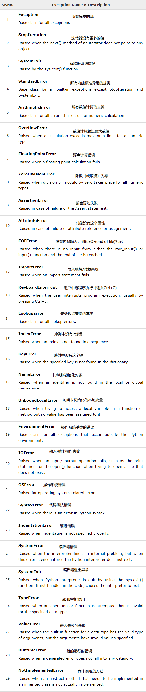

<notice>教程读者请不要直接阅读本文件，因为诸多功能在此无法正常使用，请移步至[程谱 coderecipe.cn](https://coderecipe.cn/learn/2)学习完整教程。如果您喜欢我们的教程，请在右上角给我们一个“Star”，谢谢您的支持！</notice>
异常
======
🌟你已经到到第六章啦，继续加油吧~

发生异常的情况
-----
在我们运行python程序时，有可能会出现一些**异常**（exception）。异常是一种python程序在执行过程中抛出的错误情况。比如计算机运算出`1/0`或`10%0`就会抛出`ZeroDevisionError`，如果拿了负数作为Array的index，那么就会抛出`IndexError`异常。

需要掌握的异常
-----
在Python中，有非常非常多的异常，而查证这些异常的方法更是一门很深的学问。



以上就是我们需要掌握的异常了。下面，我们将学习如何排除异常

Try...Except...Else
-----
`Try...Except`是非常实用的方法，可用来在出现异常时不致于使程序直接停止运行。甚至可以指定在出现某种异常时，执行特定的语句。`Else`则会在没有出现**任何**错误时执行。请看下面的例子:
```python
def divide(a,b):
  try:
    result=a/b
  except ZeroDivisionError:
    print("The dividend cannot be zero!")
  else:
    return result
```
如上面的代码所示，如果被除数为0时，程序不会终止运行并报错，而是会打印`The dividend cannot be zero!`。

人为制造异常
------
你看到这里可能会很奇怪，为什么需要人为制造异常？实际上，人为制造异常可能非常有用。比如说，在重复输入密码时，你可以通过用`assert`来人工制造如之前图示的`AssertionError`异常，使程序中止。在`assert`后加上判断条件，程序会在判断条件为`False`时抛出异常。
```python
def check(first,second):
  assert first==second #程序会在first不等于second的时候抛出异常
```

此外,python甚至可以让你基于内建的错误类型来制造自己的异常。`raise`函数可以帮助你实现这个功能。我们可以把之前`Try...Except...Else`里的代码进行优化，你可以尝试一下：

<lab lang="python" parameters="filename=Hello.py">
<notice>练习环境在此无法显示，请移步至[程谱 coderecipe.cn](https://coderecipe.cn/learn/2)查看。</notice>
try:
    result=a/b
  except ZeroDivisionError:
    raise ZeroDivisionError("除数不能为零！")
  else:
    return result
</lab>

小练习
------
1. 当计算了`1/0`，会发生什么结果？

(A) `ZeroDivisionError`异常

(B) `IndexError`异常

(C) 运行错误

(D) 返回`NaN`

下面的内容要按一下才会显示：
<cr type="hidden"><notice>隐藏内容功能在此无法正常显示，请移步至[程谱 coderecipe.cn](https://coderecipe.cn/learn/2)查看。</notice>A</cr>

2.试着创建一个你自己的定义的异常（Exception）
